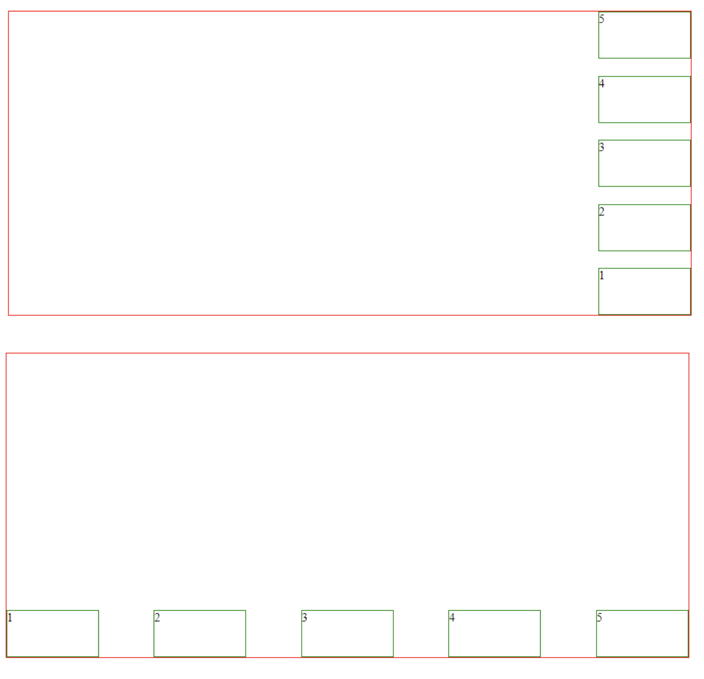
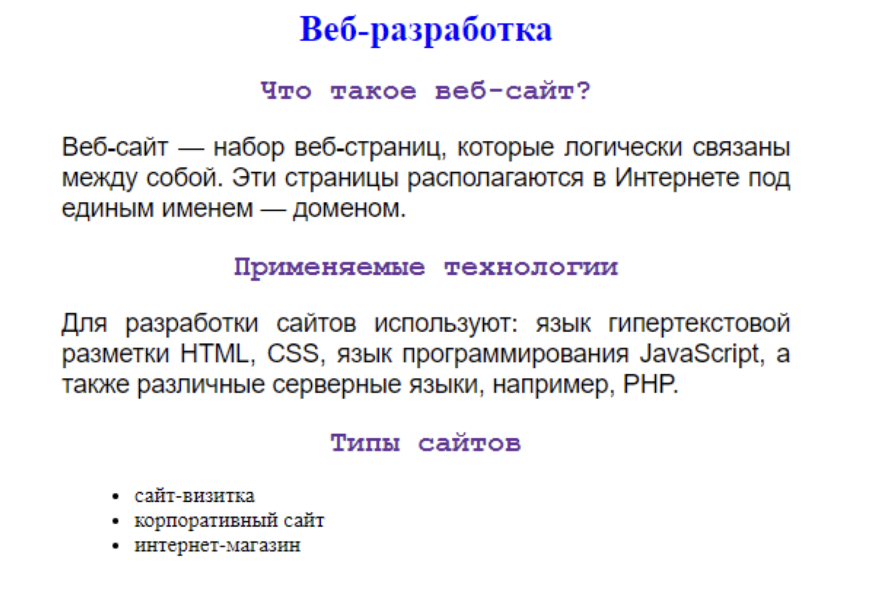
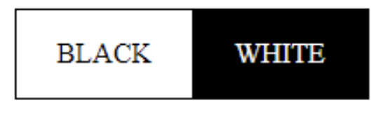
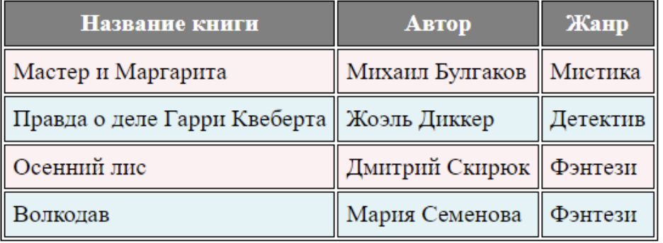

# Основы html:

Задания
1. Создайте файл index.html и создайте в нем основную структуру
HTML-документа.
2. Создайте на вашей странице 5 абзацев с каким-нибудь текстом. Один любой
абзац выделите жирным, а другой любой абзац - курсивом.
3. Создайте в своем файле все уровни заголовков. Посмотрите, как они выглядят в
браузере.
4. Создайте неупорядоченный список, перечислите в нем ваши хобби. Создайте
упорядоченный список, перечислите в нем список ваших пар на сегодняшний
день.
5. Создайте второй файл, разместите в нем параграф с указанием, что это второй
файл. Сделайте переход на него с основного файла index.html.
6. Разместите на странице вашего сайта какую-нибудь картинку.
7. Создайте таблицу, описывающую какой-то товар.

# Адаптивная верстка

Задания
1. Создайте родительский див с границей любого цвета, внутри него создайте три
дива-потомка с границами любого другого цвета. Сделайте потомки
флекс-элементами
2. Выровняйте флекс-элементы свойством justify-content всеми способами,
показанными на занятии (center, space-between, space-around, space-evenly,
flex-start, flex-end)
3. На практике посмотрите работу свойства flex-direction, попробуйте все
показанные вам направления (row, row-reverse, column, column-reverse)
4. На практике посмотрите работу свойства align-items, попробуйте все
показанные вам направления (flex-start, flex-end, center, stretch)
5. Повторите следующие примеры

# Основы СSS

Задание
1. По образцу создайте HTML страницу и стилизуйте ее. Примените классы и id.

2. С помощью HTML и CSS повторите следующий шаблон:

3. Повторите по образцу следующую таблицу:

4. Создать веб-страницу, которая расскажет о каком-то вашем хобби. Добавьте на
страницу различные HTML теги - заголовки, параграфы, фото, таблицы, ссылки,
нумерованные и маркированные списки. В файле CSS задайте стили для всех этих элементов. Выбор стилей для элементов на ваше усмотрение. У каждого
тега должно быть не менее трех различных стилей.

# Верстка сайта

Верстка макета по примеру (все материалы на диске https://disk.yandex.ru/d/8lP0oWqgMimfwQ)

# Задание по семантической верстке
Задание: вам необходимо создать верстку небольшого интернет-магазина. Верстка
должна быть написана с использованием семантических тегов. Добавьте стилизация
тегов, используйте флексы для выстраивания элементов.
Необходимые страницы:
*     ● Главная
*     ● Каталог
*     ● Контакты
С каждой страницы можно перейти на другие две страницы.
Содержание главной страницы:
*     ● Шапка (с названием компании, навигационным меню, контактами)
*     ● Секция с популярными товарами (товары перечислить списком)
*     ● Секция с новыми товарами (товары перечислить списком)
*     ● Секция с коллекциями (коллекции перечислить списком)
*     ● Подвал (с названием компании, политикой конфиденциальности (сделать
ссылкой на файл), контактами)
Содержание каталога:
*     ● Шапка (аналогична шапке с главной страницы)
*     ● Несколько карточек товара (в каждой карточке фото (при необходимости задать
      размер через width или height), название, цена)
*     ● Подвал (аналогичен подвалу с главной страницы)
Содержание контактов:
*     ● Шапка (аналогична шапке с главной страницы)
*     ● Номер телефона
*     ● Почта
*     ● Адрес
*     ● Фото карты с адресом
*     ● Подвал (аналогичен подвалу с главной страницы)